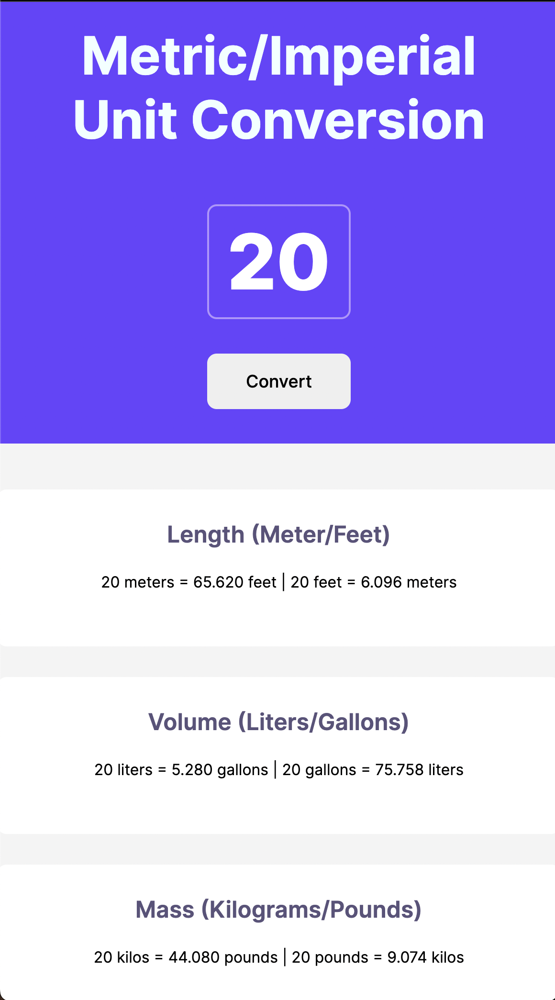

# Unit Converter

## Overview

A simple unit converter built using HTML, CSS, and JavaScript. This project provides a straightforward interface for converting metric and imperial units of length, volume, and mass.

## Features

- Convert between meters and feet
- Convert between liters and gallons
- Convert between kilograms and pounds

## Usage

1. Enter the value you want to convert into the input field.
2. Click the "Convert" button to see the conversion results.
3. Results for length, volume, and mass conversions will be displayed in their respective sections.

## Preview

## Technologies Used

- HTML
- CSS
- JavaScript

## Credits

This project was developed by [Omer Ozturk](https://github.com/diesos) as a training project.
